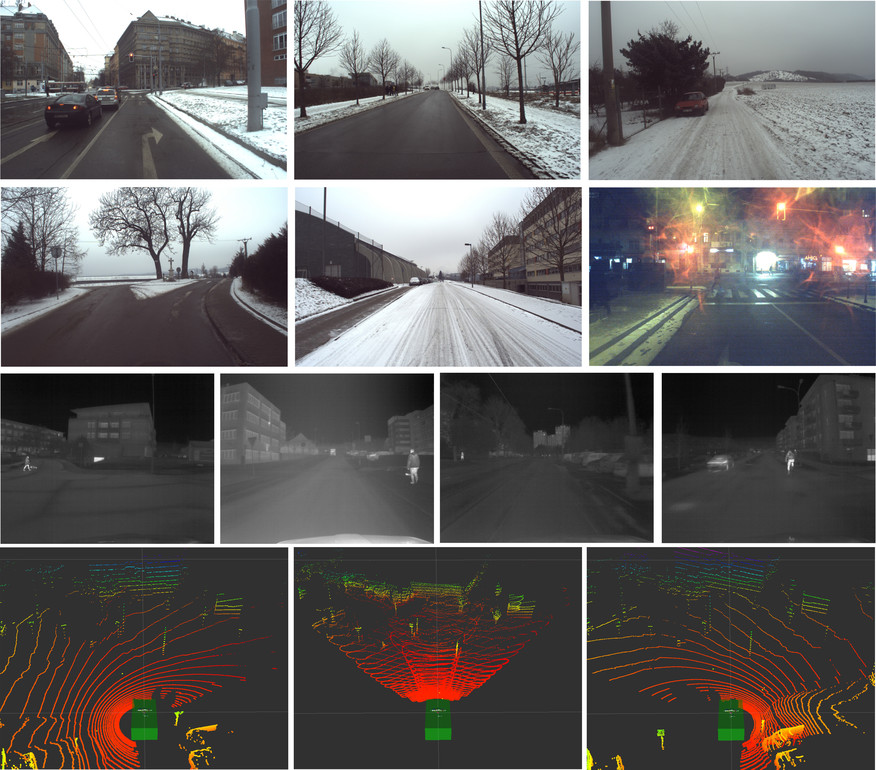
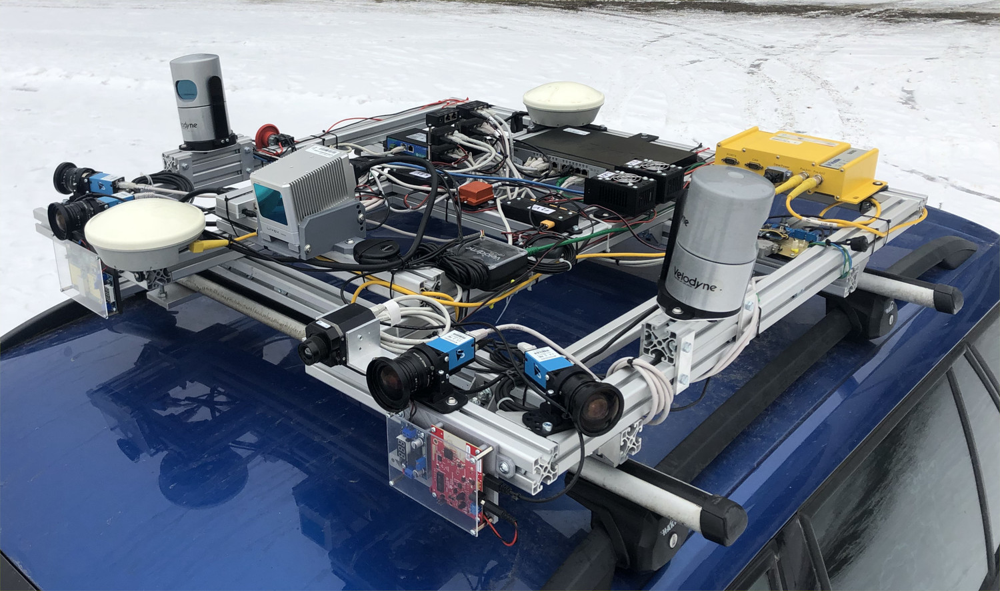
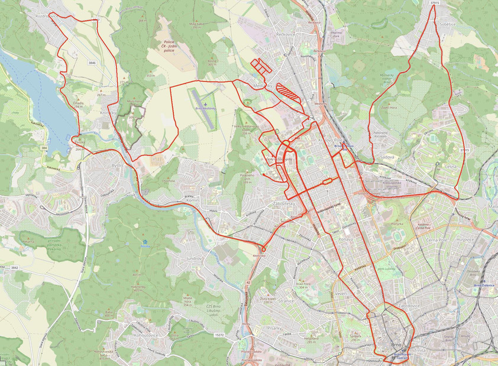

# Brno Urban Dataset

Navigation and localisation dataset for self driving cars and autonomous robots.

Research in the domain of autonomous mobile vehicles have tremendously expanded in the last few years . From one of many possible applications of general mobile robotics and a geeky interest of technical visionaries it became a large topic for both scientific and commercial sectors. Despite the undoubted motivation of financial bounties and pursuit of the emerging trends, this boom is also fueled with openly available data allowing more people to be part of it. To equip a car with state of the art sensors can easily become too expensive for small subjects such as start-ups or research groups on local universities. Sharing data allows much more researchers to participate in the progress of the field and enrich it with novel ideas, which, in the end, rewards everybody. Second good reason for data sharing is a possibility to bypass the necessity of building and maintaining the sensory apparatus, which otherwise requires extra resources and engineering skills not related to the actual research topic of artificial intelligence. Having the opportunity to build our own data acquisition system and exceeding current state of the art in some of its parameters, we have decided to make the data publicly available.

[Adam Ligocki](https://www.vutbr.cz/en/people/adam-ligocki-154791#navigace-vizitka) · [Aleš Jelínek](https://www.ceitec.cz/ing-ales-jelinek-ph-d/u91705) · [Luděk Žalud](https://scholar.google.com/citations?user=kWXqPAIAAAAJ&hl=en&oi=ao)

## Example Visualization

[](http://www.youtube.com/watch?v=wDFePIViwqY "Video")


<br>
<br>


Brief overview of the available data

<br>
<br>


The sensory framework mounted on the car roof

<br>
<br>


Map visualizatoin of the places where the data have been collected 

### Winter Extention


Data overview.

<br>
<br>


Sensory framework

<br>
<br>


Covered places

## Data Description

It is a good practice to sort the data according to its content. The time of recording serves mostly as a unique identifier and a brief description is good to get a quick overview of the recording, but both are cumbersome to use, if a whole database of all recordings is needed to be searched through. For this reason, we have employed a system of tags, which allow us to highlight the most important content and enable easy filtration of the recordings

Data structure for each record is shown in the table below. 

**RGB camera - 1920x1200px, optics: 8mm front (70deg FoV), 6mm lateral (90deg FoV)**<br>
.mp4 video      - file with h265 data encoding (can be extracted into separated image files) <br>
timestamps.txt  - <system timestamp, image seq. number, internal camera timestamp><br>
[Details](https://www.theimagingsource.com)

**IR camera FLIR Tau 2- 640x512px, optics: 19mm (69deg FoV)**<br>
.mp4 video      - file with h265 data encoding (can be extracted into separated image files) <br>
timestamps.txt  - <system timestamp, image seq. min temp., max temp><br>
[Details](https://www.flir.com)

**LiDAR Velodyne HDL-32e**<br>
scans.zip       - zip file contains all the scans taken by LiDAR during the recording. Scans are in .pcd file firmat <br>
timestamps.txt  - <system timestamp, scan seq. number, internal LiDAR’s timestamp><br>
[Details](https://velodynelidar.com/)

**IMU Xsens MTi-G-710**<br>
imu.txt       - <system timestamp, lin. acc. (X, Y, Z), ang. vel (X, Y, Z), orientation (X, Y, Z, W)><br>
mag.txt       - <system timestamp, mag. field (X, Y, Z)><br>
gnss.txt      - <system timestamp, latitude, longitude, altitude><br>
d_quat.txt    - <system timestamp, delta orientation (X, Y, Z, W)><br>
pressure.txt  - <system timestamp, pressure><br>
time.txt      - <system timestamp, UTC (year, month, day, hour, minute, second, nanosecond)><br>
temp.txt      - <system timestamp, temp><br>
[Details](https://www.xsens.com)

**GNSS Trimble 982BX**<br>
pose - <system timestamp, latitude, longitude, altitude, heading vector><br>
time - <system timestamp, UTC (year, month, day, hour, minute, second, nanosecond)><br>
[Details](https://www.trimble.com)

**LiDAR Livox Horizon (Winter Ext. only)**<br>
scans.zip	- zip file contains all the scans taken by LiDAR during the recording. Scans are in .pcd file firmat <br>
timestamps.txt  - <system timestamp, scan seq. number><br>
[Details](https://www.livoxtech.com/horizon)

**FMCW Radar - mmWave AWR1642 (Winter Ext. only)**<br>
scans.txt	- <system timestamp, number of det. obj., [list of detections, (x, y, z, vel) for each]><br>
[Details](https://www.ti.com/product/AWR1642)
	
**YOLO detections (virtual sensor, Winter Ext. only)**<br>
[camera-name].txt - <video frame index, x, y, width, height, detection confidence, class><br>
[Details](https://github.com/ultralytics/yolov5)

**Calibrations**

Currently the calibration is performed manually as a best guess. In near future we are going to provide the results of the better calculated by the dedicated software tools.  


```
<session_day_rec_part>/
└───camera_<name>/
│     video.mp4
│     timestamps.txt
│     (frameXXXXXX.jpeg)
└───lidar_<name>/
│     scans.zip
│     timestamps.txt
│     (scanXXXXXX.pcd)
└───imu/
│     imu.txt
│     mag.txt
│     gnss.txt
│     d_quat.txt
│     pressure.txt
│     time.txt
│     temp.txt
└───gnss/
│     pose.txt
│     time.txt
└───radar_ti/
│     scans.txt
└───yolo/
      camera_<name>.txt
└───calibrations/
      frames.yaml
      camera_<name>.yaml
```

<br>

The brief overview of the data distribution in the various time of the day, weather conditions or the environment types.

<br>

|Tag Category|Tag|No. of Recordings|Distance [km]|Duration [hours]|
|:---------:|:---------:|:---------:|:---------:|:---------:|
|Weather     | Sunny<br>Partly-cloudy<br>Cloudy<br>Rain | 42<br>25<br>9<br>4  | 245.1<br>130.6<br>69.6<br>18.6 | 6:23<br>4:32<br>2:17<br>0:32 |
|Daytime     | Morning<br>Noon<br>Afternoon<br>Evening  | 15<br>30<br>26<br>9 | 60.1<br>225.4<br>116.2<br>62.2 | 1:48<br>5:37<br>4:21<br>1:56 |
|Environment | City<br>Suburb<br>Country<br>Highway     | 36<br>21<br>6<br>4  | 195.4<br>112.9<br>80.9<br>74.7 | 6:26<br>3:58<br>2:09<br>1:08 |

## Data Download

To get the data on your computer please clone the repository and use any torrent client app to open the .torrent file that you are interested in. After loading the .torrent file check the data folders that you are interested in and start the content downloading.

For better search through the data please use the [recordings_table.md](recordings_table.md) in the root directory.
  
## Known Bugs

  - some IR frames in recording session no. 1 are misordered
  - IMU linear acceleration data has an inverted sign
  - For right LiDAR data the 18th row is missing and for left LiDAR data the 15th row is missing (counted from the bottom).

## Attribution

If you have used our data, please cite our original [paper](https://arxiv.org/abs/1909.06897)

```
@inproceedings{ligocki2020brno,
  title={Brno Urban Dataset-The New Data for Self-Driving Agents and Mapping Tasks},
  author={Ligocki, Adam and Jelinek, Ales and Zalud, Ludek},
  booktitle={2020 IEEE International Conference on Robotics and Automation (ICRA)},
  pages={3284--3290},
  year={2020},
  organization={IEEE}
}
```

## Acknowledgement

The research was supported by ECSEL JU under the project H2020 737469 AutoDrive - Advancing fail-aware, fail-safe, and fail-operational electronic components, systems, and architectures for fully automated driving to make future mobility safer, affordable, and end-user acceptable. This research has been financially supported by the Ministry of Education, Youth and Sports of the Czech republic under the project CEITEC 2020 (LQ1601).

The work has been performed in the project NewControl: Integrated, Fail-Operational, Cognitive Perception, Planning and Control Systems for Highly Automated Vehicles, under grant agreement No 826653/8A19006. The work was co-funded by grants of Ministry of Education, Youth and Sports of the Czech Republic and  Electronic Component Systems for European Leadership Joint Undertaking (ECSEL JU).

The work has been performed in the project ArchitectECA2030: Trustable architectures with acceptable residual risk for the electric, connected and automated cars, under grant agreement No 877539/8A20002. The work was co-funded by grants of Ministry of Education, Youth and Sports of the Czech Republic and  Electronic Component Systems for European Leadership Joint Undertaking (ECSEL JU). The work was supported by the infrastructure of RICAIP that has received funding from the European Union's Horizon 2020 research and innovation programme under grant agreement No 857306 and from Ministry of Education, Youth and Sports under OP RDE grant agreement No CZ.02.1.01/0.0/0.0/17_043/0010085.
