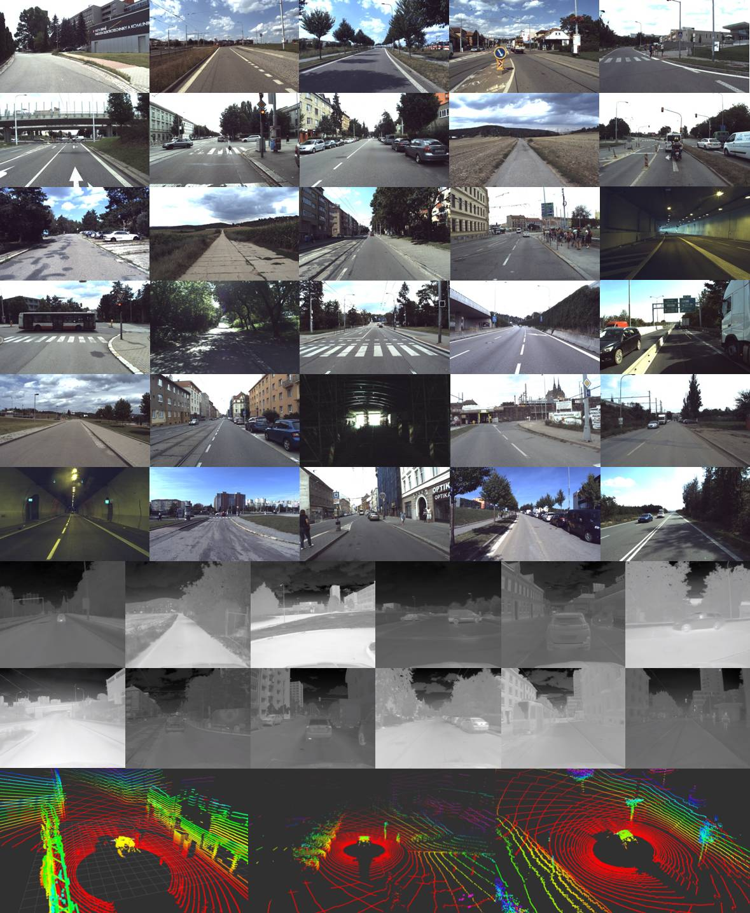
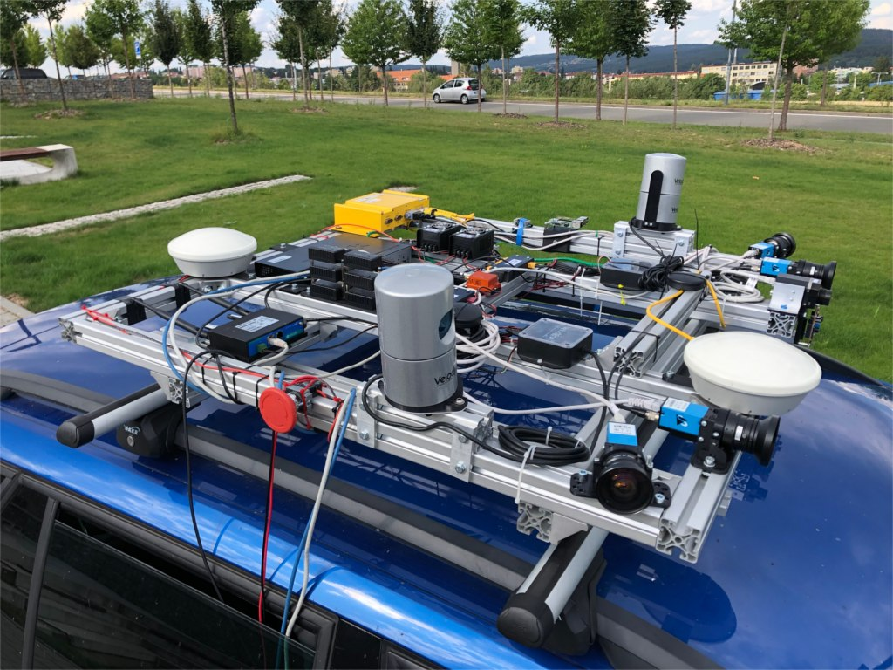
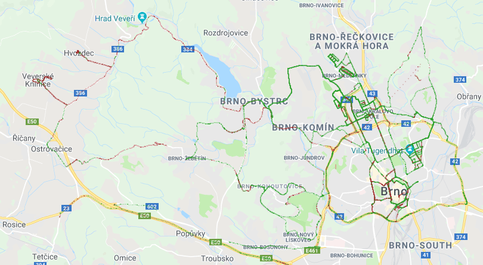

# Brno Urban Dataset

Navigation and localisation dataset for self driving cars and autonomous robots.

Research in the domain of autonomous mobile vehicles have tremendously expanded in the last few years . From one of many possible applications of general mobile robotics and a geeky interest of technical visionaries it became a large topic for both scientific and commercial sectors. Despite the undoubted motivation of financial bounties and pursuit of the emerging trends, this boom is also fueled with openly available data allowing more people to be part of it. To equip a car with state of the art sensors can easily become too expensive for small subjects such as start-ups or research groups on local universities. Sharing data allows much more researchers to participate in the progress of the field and enrich it with novel ideas, which, in the end, rewards everybody. Second good reason for data sharing is a possibility to bypass the necessity of building and maintaining the sensory apparatus, which otherwise requires extra resources and engineering skills not related to the actual research topic of artificial intelligence. Having the opportunity to build our own data acquisition system and exceeding current state of the art in some of its parameters, we have decided to make the data publicly available.

[Adam Ligocki](https://www.vutbr.cz/en/people/adam-ligocki-154791#navigace-vizitka) · [Aleš Jelínek](https://www.ceitec.cz/ing-ales-jelinek-ph-d/u91705) · [Luděk Žalud](https://scholar.google.com/citations?user=kWXqPAIAAAAJ&hl=en&oi=ao)

## Example Visualization

[Comming soon]

Dataset Video

<br>
<br>


Brief overview of the available data

<br>
<br>


The sensory framework mounted on the car roof

<br>
<br>


Map visualizatoin of the places where the data have been collected 

## Data Description

It is a good practice to sort the data according to its content. The time of recording serves mostly as a unique identifier and a brief description is good to get a quick overview of the recording, but both are cumbersome to use, if a whole database of all recordings is needed to be searched through. For this reason, we have employed a system of tags, which allow us to highlight the most important content and enable easy filtration of the recordings

Data structure for each record is shown in the table below. 

**RGB camera - 1920x1200px, optics: 8mm front (70deg FoV), 6mm lateral (90deg FoV)**<br>
.mp4 video      - file with h265 data encoding (can be extracted into separated image files) <br>
timestamps.txt  - <system timestamp, image seq. number, internal camera timestamp><br>


**IR camera - 640x512px, optics: 19mm (69deg FoV)**<br>
.mp4 video      - file with h265 data encoding (can be extracted into separated image files) <br>
timestamps.txt  - <system timestamp, image seq. min temp., max temp><br>


**LiDAR**<br>
scans.zip       - zip file contains all the scans taken by LiDAR during the recording. Scans are in .pcd file firmat <br>
timestamps.txt  - <system timestamp, scan seq. number, internal LiDAR’s timestamp><br>


**IMU**<br>
imu.txt       - <system timestamp, lin. acc. (X, Y, Z), ang. vel (X, Y, Z), orientation (X, Y, Z, W)><br>
mag.txt       - <system timestamp, mag. field (X, Y, Z)><br>
gnss.txt      - <system timestamp, latitude, longitude, altitude><br>
d_quat.txt    - <system timestamp, delta orientation (X, Y, Z, W)><br>
pressure.txt  - <system timestamp, pressure><br>
time.txt      - <system timestamp, UTC (year, month, day, hour, minute, second, nanosecond)><br>
temp.txt      - <system timestamp, temp><br>


**GNSS**<br>
pose - <system timestamp, latitude, longitude, altitude, heading vector><br>
time - <system timestamp, UTC (year, month, day, hour, minute, second, nanosecond)><br>


**Calibrations**

Lorem Ipsum


```
<session_day_rec_part>/
└───camera_<name>/
│     video.mp4
│     timestamps.txt
│     (frameXXXXXX.jpeg)
└───lidar_<name>/
│     scans.zip
│     timestamps.txt
│     (scanXXXXXX.pcd)
└───imu/
│     imu.txt
│     mag.txt
│     gnss.txt
│     d_quat.txt
│     pressure.txt
│     time.txt
│     temp.txt
└───gnss/
│     pose.txt
│     time.txt
└───calibrations/
      frames.yaml
      camera_<name>.yaml
```

<br>

The brief overview of the datadistribution in the various time of the day, weather conditions or the environment types.

<br>

|Tag Category|Tag|No. of Recordings|Distance [km]|Duration [hours]|
|:---------:|:---------:|:---------:|:---------:|:---------:|
|Weather  | Sunny<br>Partly-cloudy  | 42<br>25  | 245.1<br>130.6  | 6:23<br>4:32 |
|Daytime  | Morning<br>Noon<br>Afternoon<br>Evening  | 15<br>26<br>21<br>5 | 60.1<br>175.6<br>96.4<br>43.6  | 1:48<br>4:04<br>3:37<br>1:24 |
|Environment  | City<br>Suburb<br>Country<br>Highway  | 36<br>21<br>6<br>4  | 181.9<br>71.0<br>48.1<br>74.7  | 5:56<br>2:34<br>1:16<br>1:08 |

## Data Download

To get the data on your computer please clone the repository and use any torrent client app to open the .torrent file that you are interested in. After loading the .torrent file check the data folders that you are interested in and start the content downloading.

For better search through the data please use the tag_<domain> folders in the root directory.
  
## Known Bugs

  - some IR frames in recording session no. 1 are misordered

## Attribution

If you have used our data, please cite our original paper

Comming soon ... 


